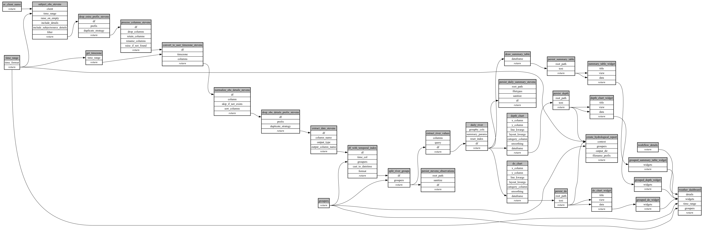

```
# AUTOGENERATED BY ECOSCOPE-WORKFLOWS; see fingerprint in README.md for details

```

```yaml
# fingerprint:
artifacts_sha256_basic: 9f555697631b483c15f7e7b7ea14e54e8a602bf0dc9eb11705575a9322c8192f
artifacts_sha256_strict: 3cf4142250b2d8a2845b16a4241ea11982afe5daa8f3b34270d5322d9203e2cf
installed_requirements:
- channel: https://repo.prefix.dev/ecoscope-workflows/
  name: ecoscope-workflows-core
  version: {version: ==0.19.3}
- channel: https://repo.prefix.dev/ecoscope-workflows/
  name: ecoscope-workflows-ext-ecoscope
  version: {version: ==0.20.2.dev11+g37295c202.d20260110}
- channel: https://repo.prefix.dev/ecoscope-workflows-custom/
  name: ecoscope-workflows-ext-custom
  version: {version: ==0.0.14.dev0+g3f451d57d.d20260110}
params_sha256: 5975fbcee169f077e9b5c4bc7bcc61a4e487c838f9e2eb36131ead239328d6c3
spec_sha256: 087202a85c12032971cfd7d169aa59b27a40e2e8ae221877acbec93a3286b541

```

# ecoscope-workflows-hydrological-monitoring-workflow


